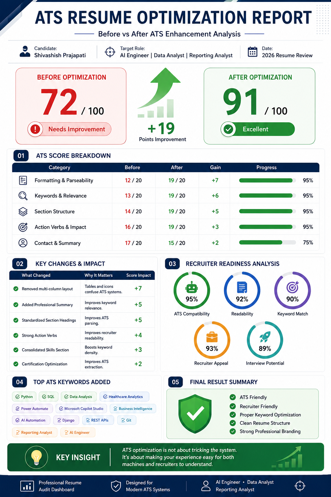

# Day 06 - ATS Resume Optimization with Claude AI

## 🎯 Objective

Learn how Claude AI can be used to optimize resumes for Applicant Tracking Systems (ATS) while improving recruiter readability, keyword relevance, and professional branding.

---

# 📄 What is ATS Resume Optimization?

Applicant Tracking Systems (ATS) are software tools used by companies to scan, filter, and rank resumes before they reach recruiters.

A well-optimized resume improves the chances of:

* Passing ATS screening
* Matching job descriptions
* Increasing recruiter visibility
* Securing interviews

Claude AI can help analyze resumes and suggest improvements while keeping all information truthful and ATS-friendly.

---

# 🚀 Why ATS Optimization Matters

## 1. ATS Compatibility

Many resumes are rejected before a recruiter sees them because:

* Poor formatting
* Missing keywords
* Non-standard section headings
* Complex layouts

Claude helps create ATS-friendly resume structures.

---

## 2. Recruiter Readability

A resume should be easy for recruiters to scan within seconds.

Benefits:

✅ Clear structure

✅ Professional formatting

✅ Strong action verbs

✅ Easy-to-read achievements

---

## 3. Professional Branding

Your resume is your personal marketing document.

Claude helps:

* Improve summaries
* Highlight strengths
* Showcase projects
* Present skills effectively

---

## 4. Career Readiness

An optimized resume improves opportunities for:

* Internships
* Full-Time Jobs
* Career Transitions
* AI & Tech Roles

---

# 📊 ATS Resume Audit

## Candidate

**Shivashish Prajapati**

### Target Roles

* AI Engineer
* Data Analyst
* Reporting Analyst

### Review Type

ATS Resume Optimization

---

# 📈 ATS Score Improvement

## Before Optimization

**72 / 100**

Status:

⚠️ Needs Improvement

---

## After Optimization

**91 / 100**

Status:

✅ Excellent

---

### Improvement

**+19 Points**

---

# 📋 ATS Score Breakdown

| Category                  | Before | After | Gain |
| ------------------------- | ------ | ----- | ---- |
| Formatting & Parseability | 12/20  | 19/20 | +7   |
| Keywords & Relevance      | 13/20  | 19/20 | +6   |
| Section Structure         | 14/20  | 19/20 | +5   |
| Action Verbs & Impact     | 16/20  | 19/20 | +3   |
| Contact & Summary         | 17/20  | 19/20 | +2   |

---

# 🛠 Key Resume Improvements

## ✓ Removed Multi-Column Layout

Why:

ATS systems often struggle with complex layouts.

Impact:

+7 Score

---

## ✓ Added Professional Summary

Why:

Improves keyword relevance and recruiter understanding.

Impact:

+5 Score

---

## ✓ Standardized Section Headings

Why:

Improves ATS parsing and resume structure.

Impact:

+5 Score

---

## ✓ Improved Action Verbs

Why:

Makes achievements stronger and more professional.

Impact:

+4 Score

---

## ✓ Consolidated Skills Section

Why:

Improves keyword density and ATS matching.

Impact:

+3 Score

---

## ✓ Optimized Certifications

Why:

Improves ATS extraction of certifications and credentials.

Impact:

+2 Score

---

# 🤖 Recruiter Readiness Analysis

| Area                | Score |
| ------------------- | ----- |
| ATS Compatibility   | 95%   |
| Readability         | 92%   |
| Keyword Match       | 90%   |
| Recruiter Appeal    | 93%   |
| Interview Potential | 89%   |

---

# 🔑 Top ATS Keywords Added

### Technical Skills

* Python
* SQL
* Django
* REST APIs
* Git

### Analytics & Reporting

* Data Analysis
* Business Intelligence
* Healthcare Analytics
* Reporting Analyst

### AI & Automation

* AI Automation
* Microsoft Copilot Studio
* Power Automate
* AI Engineer

---

# 📚 What I Learned

## ATS Optimization

A resume must be structured so software can parse it correctly.

---

## Recruiter Readability

Clear formatting helps recruiters understand experience faster.

---

## Keyword Optimization

Using role-specific keywords improves ATS rankings.

---

## Professional Branding

A strong summary and project descriptions increase credibility.

---

# 🎨 Practical Exercise

Created an ATS Resume Optimization Dashboard infographic showing:

* ATS Score Comparison
* Resume Audit Results
* Key Improvements
* Recruiter Readiness Analysis
* ATS Keywords Added

## Image

---

# 💡 Key Insight

> ATS optimization is not about tricking the system.

> It is about making your experience easy for both machines and recruiters to understand.

---

# 🏆 My Biggest Takeaway

Claude AI can significantly improve resume quality by identifying formatting issues, keyword gaps, and readability problems while ensuring all information remains accurate and truthful.

A well-optimized resume increases visibility, improves recruiter engagement, and creates stronger opportunities for interviews.

---

## ✅ Status

Day 06 Completed
