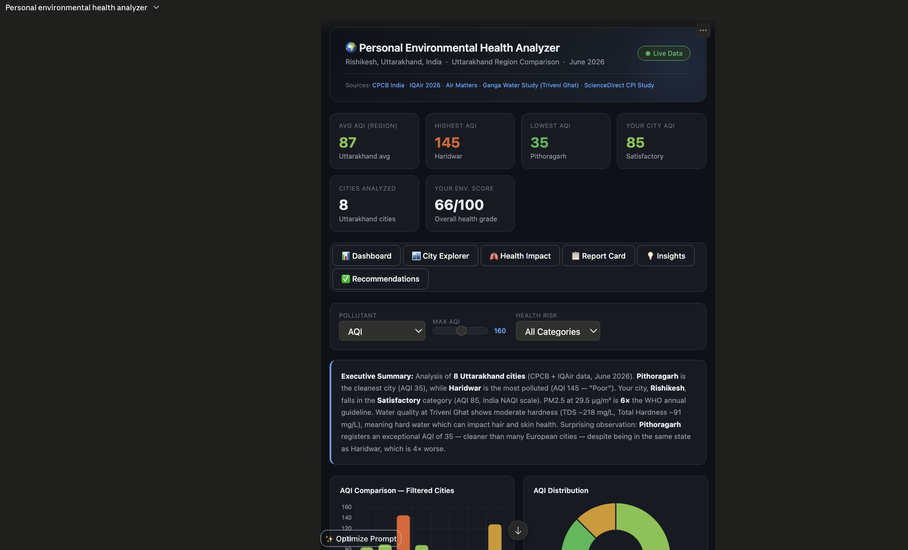

# Day 08 - Personal Environmental Health Analyzer

## 🎯 Objective

Learn how Claude Artifacts can transform detailed prompts into fully interactive applications by creating an AI-powered Environmental Health Dashboard that combines air quality, water quality, personal health insights, analytics, and intelligent recommendations.

---

# 🌍 What is the Personal Environmental Health Analyzer?

The Personal Environmental Health Analyzer is an AI-powered dashboard designed to analyze environmental conditions and their impact on personal health.

Instead of displaying raw environmental data, the application converts data into meaningful health insights, environmental scores, visual analytics, and actionable recommendations.

The dashboard combines:

* Air Quality Analysis
* Water Quality Intelligence
* Health Risk Assessment
* Interactive Data Visualization
* Personalized Recommendations
* AI-Powered Insights

---

# 🚀 What I Learned

## 1. Claude Artifacts

Claude Artifacts enable the creation of real applications rather than text-only responses.

Capabilities include:

* Interactive Dashboards
* Data Visualization Tools
* Business Applications
* Calculators
* Simulators
* Full HTML Applications

### Key Insight

Artifacts turn prompts into usable software products.

---

## 2. Interactive Dashboard Design

A high-quality dashboard should include:

### KPI Cards

* Average AQI
* Highest AQI City
* Lowest AQI City
* Environmental Health Score
* Water Quality Score

### Interactive Filters

* City Selector
* AQI Range Filter
* Pollutant Filter
* Health Risk Filter
* Date Filter

### Dynamic Visualizations

* AQI Trends
* PM2.5 Analysis
* PM10 Analysis
* City Rankings
* Distribution Charts

---

## 3. Environmental Intelligence

The dashboard analyzes:

### Air Quality

* AQI
* PM2.5
* PM10
* Pollution Categories

### Water Quality

* Water Safety
* Chemical Exposure
* Purification Effectiveness

### Health Impact

Environmental data is translated into health insights for:

* Lungs
* Sleep
* Energy Levels
* Exercise Performance
* Hair Health
* Skin Health

---

## 4. AI Product Development

This project demonstrates how prompts can be transformed into complete AI products.

Instead of asking Claude for information, Claude is instructed to build:

* User Interface
* Data Layer
* Analytics Layer
* Recommendation Engine
* Reporting System

---

# 📊 Dashboard Features

## Environmental Metrics

### Air Quality

* Average AQI
* Highest AQI City
* Lowest AQI City
* Air Quality Category

---

### Water Quality

* Water Quality Score
* Water Safety Indicators
* Water Health Impact

---

### Environmental Health Score

Combines:

* Air Quality Score
* Water Quality Score
* Overall Environmental Score

Produces a score from:

0–100

---

# 📈 Interactive Visualizations

The dashboard includes:

### AQI Comparison Chart

Compare pollution levels across cities.

---

### PM2.5 Analysis

Monitor fine particle concentration.

---

### PM10 Analysis

Track airborne particulate pollution.

---

### City Ranking Dashboard

Identify:

* Cleanest Cities
* Most Polluted Cities

---

### AQI Distribution Analysis

Visualize pollution patterns and anomalies.

---

# 🎛 Interactive Controls

## City Selector

Analyze individual cities.

---

## AQI Filter

Filter by pollution level.

---

## Pollutant Selector

Switch between:

* AQI
* PM2.5
* PM10

---

## Health Risk Filter

Identify:

🟢 Low Risk

🟡 Moderate Risk

🔴 High Risk

---

## Comparison Mode

Compare multiple cities simultaneously.

---

# 🩺 Health Impact Analysis

Environmental conditions directly affect personal health.

---

## 🫁 Lungs

Impacts:

* Breathing Quality
* Respiratory Health
* Long-Term Lung Function

Risk Levels:

🟢 Low

🟡 Moderate

🔴 High

---

## 😴 Sleep Quality

Pollution can affect:

* Sleep Duration
* Recovery Quality
* Fatigue Levels

---

## ⚡ Energy Levels

Environmental conditions influence:

* Daily Productivity
* Concentration
* Mental Performance

---

## 🏃 Exercise Performance

Provides recommendations for:

* Outdoor Activities
* Running
* Fitness Routines

Based on pollution conditions.

---

## 💇 Hair Health

Water quality impacts:

* Hair Fall
* Hair Dryness
* Scalp Sensitivity

---

## ✨ Skin Health

Environmental conditions affect:

* Acne
* Dryness
* Irritation
* Sensitive Skin

---

# 📋 Environmental Report Card

The dashboard generates:

### Air Quality Grade

A–F

---

### Water Quality Grade

A–F

---

### Hair Risk Score

Low / Moderate / High

---

### Skin Risk Score

Low / Moderate / High

---

### Overall Environmental Health Score

0–100

---

# 🔍 AI Insights Panel

The system automatically identifies:

### Top 3 Cleanest Cities

🥇 Cleanest City

🥈 Second Cleanest

🥉 Third Cleanest

---

### Top 3 Most Polluted Cities

🔴 Highest AQI

🔴 Severe Pollution

🔴 Critical Environmental Risk

---

### Biggest Anomaly

Unexpected environmental patterns.

---

### Most Surprising Observation

Interesting trends identified through analysis.

---

# 🤖 Personalized Recommendations

## Indoor Air Improvements

* Air Purifiers
* Better Ventilation
* Humidity Control

---

## Outdoor Activity Guidance

* Best Exercise Times
* Pollution Alerts
* Risk Monitoring

---

## Hair Care Recommendations

* Filtered Water
* Hydration
* Scalp Protection

---

## Skin Care Recommendations

* Moisturization
* Pollution Protection
* Sensitive Skin Care

---

## Water Quality Improvements

* Filtration Systems
* Water Purification
* Quality Monitoring

---

# 🛠 Technologies Used

### Data & Analytics

* Python
* SQL
* Data Analysis

### Frontend

* HTML
* CSS
* JavaScript

### Visualization

* Interactive Charts
* KPI Dashboards
* Analytics Components

### AI

* Claude AI
* Prompt Engineering
* Claude Artifacts

### Domain

* Environmental Analytics
* Healthcare Intelligence

---

# 📚 What You'll Learn

## Artifacts

Generate complete applications instead of text-only outputs.

---

## Interactive Dashboards

Build charts, filters, cards, and visual interfaces.

---

## HTML Application Generation

Create downloadable applications that run locally.

---

## AI Product Building

Transform prompts into real products.

---

# 🎨 Practical Exercise

Created a premium Claude-style Environmental Intelligence Dashboard featuring:

* Environmental Health Analysis
* AQI Monitoring
* Water Quality Intelligence
* Health Risk Assessment
* Interactive Analytics
* Personalized Recommendations

## Image

---

# 💡 Key Insight

> Claude Artifacts allow AI to move beyond answering questions and begin building complete products.

> The future of AI is not just generating content — it is generating software.

---

# 🏆 My Biggest Takeaway

By combining prompt engineering, dashboard design, data analytics, health intelligence, and Claude Artifacts, a simple idea can be transformed into a fully interactive application.

This project demonstrated how AI can function as a product builder, analyst, designer, and developer simultaneously.

---

## ✅ Status

Day 08 Completed
